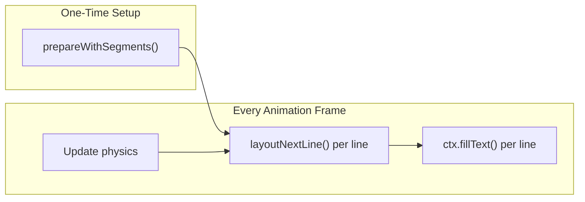

# Mind-Blowing Pretext Overhaul

## The Core Problem

Current `pretext-effects.js` uses Pretext almost exclusively as a **character-width ruler** (`prepareWithSegments` + `walkLineRanges` at width 9999). The most powerful API -- `layoutNextLine()` -- is imported but **never called**. That function is exactly what powers the Editorial Engine, Umbrella Reflow, and every obstacle-based demo that looks mind-blowing.

## Architecture: Canvas-First, Zero DOM Churn

Every visual effect renders to `<canvas>`, never manipulates DOM per frame. Pretext does all measurement without DOM reads. This means:




Zero DOM reads per frame. Zero layout thrashing. 60fps guaranteed.

## Effect 1: Editorial Orb Reflow (About Section) -- The Showstopper

Inspired directly by the **Editorial Engine demo**. The about section text reflows in real-time around floating physics-driven orbs on a canvas overlay.

**How it works:**

- Hide original `#about` paragraphs, overlay a full-section `<canvas>`
- Concatenate paragraph text, call `prepareWithSegments()` once
- Spawn 2-3 soft-glow orbs in the accent color, each with position + velocity
- Each frame:
  1. Update orb physics: gentle drift, wall bounce, mouse pushes orbs
  2. For each text line at y-position, compute the horizontal interval(s) blocked by orbs using circle-line intersection math: `halfChord = sqrt(r^2 - (y - cy)^2)`, exclusion = `[cx - halfChord, cx + halfChord]`
  3. Pick the widest free interval, call `layoutNextLine(prepared, cursor, intervalWidth)`
  4. Draw `line.text` on canvas at the correct x-offset with `ctx.fillText()`
  5. Draw orbs as radial gradients (warm glow matching `--accent-color`)
- Mouse acts as an additional repulsion force on orbs (push them around)
- On mobile: simpler layout, fewer orbs, slower physics

**Key file:** [pretext-effects.js](pretext-effects.js) -- new `initEditorialReflow(P)` function.

**API usage:** `prepareWithSegments()`, `layoutNextLine()` (the unused powerhouse), circle-interval arithmetic from [wrap-geometry patterns](https://chenglou.me/pretext/).

## Effect 2: Particle Q with Spring Physics (Header)

Replace the current static-feeling ASCII Q with a proper particle simulation.

**How it works:**

- Sample the Q shape on an offscreen canvas (existing `sample()` logic)
- Each bright pixel becomes a **particle** with: `{x, y, vx, vy, targetX, targetY, char}`
- Character chosen by brightness, width measured via `prepareWithSegments()`
- On init: particles spawn at random positions across the header
- Each frame:
  - Apply **spring force** toward target: `F = -k * (pos - target) - damping * vel`
  - Apply **mouse repulsion**: within radius, push particles away proportional to proximity
  - Integrate velocity + position
  - Draw each particle with `ctx.fillText()` at its current position
- Result: characters continuously wobble subtly, scatter when mouse approaches, spring back organically
- Add periodic "disturbance pulses" that briefly increase spring length for a wave effect

## Effect 3: Character Cascade on Scroll (Headings)

Replace the current scramble with physics-based character arrivals.

**How it works:**

- On scroll-into-view, each `h2` text node is split into Pretext-measured `<span>`s (preserving `.accent-dot` children via TreeWalker)
- Characters start offset (staggered Y + slight X scatter) with `opacity: 0`
- Spring physics in JS animates each character to its home position with a staggered delay
- Characters overshoot slightly and settle (damped spring), creating a satisfying cascade
- One rAF loop per heading, stops after all characters settle (< 1 second)
- Much more impressive than random-char scramble: characters feel like they have **weight**

## What Stays (Practical, Non-Visual)

- `initBalancedSiteText` -- text balancing (uses `prepare` + `layout`, no animation)
- `initTightBlogHeadlines` -- tight-wrapped blog titles
- `initNoShiftLoading` -- height reservation for async content

## What Gets Removed

- **Cat walker** -- replaced by the far more impressive orb reflow; the orbs ARE the creative element in `#about` now
- **Footer wave** -- too basic for the new standard
- **Magnetic titles** -- too basic
- **Current heading scramble** -- replaced by character cascade

## Import Update

Add `layoutWithLines` to the module import in [index.html](index.html) (and other pages):

```js
import { prepare, prepareWithSegments, layout, layoutWithLines, layoutNextLine, walkLineRanges }
  from 'https://esm.sh/@chenglou/pretext@0.0.4';
window.Pretext = { prepare, prepareWithSegments, layout, layoutWithLines, layoutNextLine, walkLineRanges };
```

## CSS Changes

In [style.css](style.css):

- Add styles for the editorial canvas overlay (`.pretext-editorial-canvas`)
- Keep `.pretext-ascii-canvas` styles (particle Q still uses canvas)
- Add `.pretext-cascade-char` for heading cascade spans
- Remove defunct cat/wave/magnetic styles
- Canvas overlays use `pointer-events: none` except for orb mouse interaction layer

## Performance Budget

- **Orb reflow**: 1 rAF loop, ~150 `layoutNextLine()` calls/frame (pure arithmetic, sub-0.1ms each), ~150 `fillText` calls. No DOM reads.
- **Particle Q**: 1 rAF loop, ~200-400 particles, spring physics is trivial math. No DOM reads.
- **Cascade**: Temporary rAF per heading (~20-30 particles), dies after 1 second. One-shot.
- **Total continuous loops**: 2 (orb reflow + particle Q), both canvas-only.

