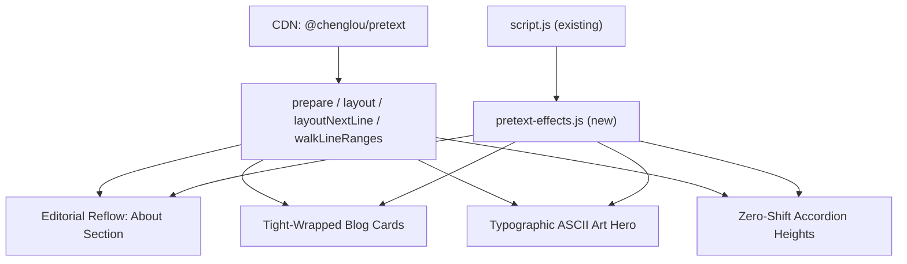

# Pretext.js Creative Integration for [qusai.pro](http://qusai.pro)

## Context

Your site (`[index.html](index.html)`) is a static vanilla JS personal portfolio with a warm chocolate/beige aesthetic, custom cursor, terminal easter egg, GitHub live feed, and AOS scroll animations. Pretext.js (`@chenglou/pretext`) is a pure-JS text measurement engine that computes line breaks and heights ~600x faster than the DOM -- enabling creative typography effects that are impossible with CSS alone.

## Architecture

Load Pretext.js via CDN (no bundler needed). Add a new `pretext-effects.js` file that initializes all Pretext-powered features after the library loads. All effects respect `prefers-reduced-motion` and the existing theme system.




---

## Feature 1: Editorial Text Reflow (About Section)

**Inspired by:** [Editorial Engine demo](https://pretextjs.dev/pretext-demo) -- text reflowing around moving obstacles in real time.

**What it does:** In the `#about` section, an animated floating orb (a soft glowing circle with your theme's accent color, evoking a security shield or "digital sun") drifts gently using a simple physics/sine-wave animation. The paragraph text reflows around it in real time using `layoutNextLine()` with variable widths per line. The text wraps organically around the shape as it moves -- zero DOM measurements per frame.

**Implementation:**

- Use `prepareWithSegments()` on the About section's paragraph text
- On each animation frame, calculate the orb's position (sine-wave drift)
- For each line, compute the available width by subtracting the orb's circular exclusion zone
- Render lines to a `<canvas>` overlay or by positioning `<span>` elements
- Fall back to normal CSS layout if `prefers-reduced-motion: reduce`
- The orb subtly reacts to mouse proximity (repels slightly from the cursor)

**Key files:** `[index.html](index.html)` `#about` section, new `pretext-effects.js`

---

## Feature 2: Tight-Wrapped Blog Post Cards

**Inspired by:** [Tight Chat Bubbles demo](https://pretextjs.dev/pretext-demo) -- binary search for minimum width that preserves line count.

**What it does:** When Medium posts load into `#recent-medium-posts`, each card's title and description get tight-wrapped using Pretext.js. Instead of filling the full card width with wasted whitespace, each text block shrinks to its natural minimum width. This creates an elegant, editorial feel where every card has a unique organic shape.

**Implementation:**

- After blog posts render in `loadMediumPosts()`, run a Pretext.js pass on each `.blog-post` card
- Use `walkLineRanges()` with binary search to find the minimum container width that keeps the same line count
- Apply the computed tight width to each text element
- Works with the existing `blog-grid` layout

**Key files:** `[script.js](script.js)` `loadMediumPosts()` function (line ~424), `[style.css](style.css)` `.blog-post` styles

---

## Feature 3: Typographic ASCII Art Animation

**Inspired by:** [Typographic ASCII Art demo](https://pretextjs.dev/pretext-demo) -- particle-driven ASCII art using measured glyph widths.

**What it does:** A subtle, animated typographic element in the hero/header area. The text "QUSAI" (or a security lock symbol) is rendered as a particle field where each particle is a character from a character set (e.g., `01{}[]<>/#$`). Pretext.js's `prepareWithSegments()` measures individual glyph widths to precisely map characters to brightness levels, creating a proportional-font ASCII art effect that pulses and shifts subtly.

**Implementation:**

- Create a `<canvas>` element behind the header profile section
- Map a silhouette shape (the letter Q, or a lock icon) to a grid
- Use `prepareWithSegments()` to measure character widths in the body font
- Assign characters to grid cells based on brightness-to-width mapping
- Animate with subtle drift/wave; characters fade in on page load
- Use the site's accent colors (`#D2B48C` tan, `#F5F5DC` beige)
- Canvas is semi-transparent, acting as a background texture
- Disabled entirely on mobile (< 768px) and reduced-motion

**Key files:** `[index.html](index.html)` header area, new `pretext-effects.js`, `[style.css](style.css)` header styles

---

## Feature 4: Zero-Shift Accordion Heights

**Inspired by:** [Accordion Heights demo](https://pretextjs.dev/pretext-demo) -- smooth CSS transitions powered by accurate height prediction.

**What it does:** The project cards in `#featured`, `#experience`, and `#projects` get a "Read more" toggle for long descriptions. Pretext.js pre-calculates the expanded height before the animation starts, enabling buttery CSS transitions with zero layout shift. The GPG section also benefits -- its expand/collapse becomes perfectly smooth.

**Implementation:**

- On page load, run `prepare()` + `layout()` on each project card's description text
- Store the computed full height as a data attribute
- Truncate long descriptions (> 3 lines) with a "Read more" toggle
- On click, set `max-height` to the pre-computed value for a smooth CSS transition
- Re-compute on window resize (only `layout()` -- instant, reuses the prepared handle)
- Works with existing card styles in `[style.css](style.css)` `.project-card-enhanced`

**Key files:** `[index.html](index.html)` project sections, `[script.js](script.js)` `initProjectCards()`, `[style.css](style.css)`

---

## File Changes Summary


| File | Change |
| ---- | ------ |


- `[index.html](index.html)`: Add Pretext.js CDN script tag, add `pretext-effects.js` script tag, add canvas element in About section, minor markup additions for tight-wrap targets
- `**pretext-effects.js` (new)**: All four Pretext.js features -- editorial reflow, tight-wrap, ASCII art, accordion heights
- `[style.css](style.css)`: Styles for editorial reflow canvas, tight-wrapped cards, ASCII art canvas, accordion transitions, reduced-motion fallbacks
- `[script.js](script.js)`: Small hooks to integrate with existing `loadMediumPosts()` and `initProjectCards()`, calling into `pretext-effects.js` functions

## Loading Strategy

```html
<!-- At bottom of body, after script.js -->
<script type="module">
  import { prepare, prepareWithSegments, layout, layoutNextLine, walkLineRanges }
    from 'https://esm.sh/@chenglou/pretext@0.0.4'
  window.Pretext = { prepare, prepareWithSegments, layout, layoutNextLine, walkLineRanges }
  // Then init pretext effects
</script>
<script src="pretext-effects.js"></script>
```

The library is ~15KB gzipped, zero dependencies, loaded async so it never blocks initial paint. All features are progressive enhancements -- the site works perfectly without them.